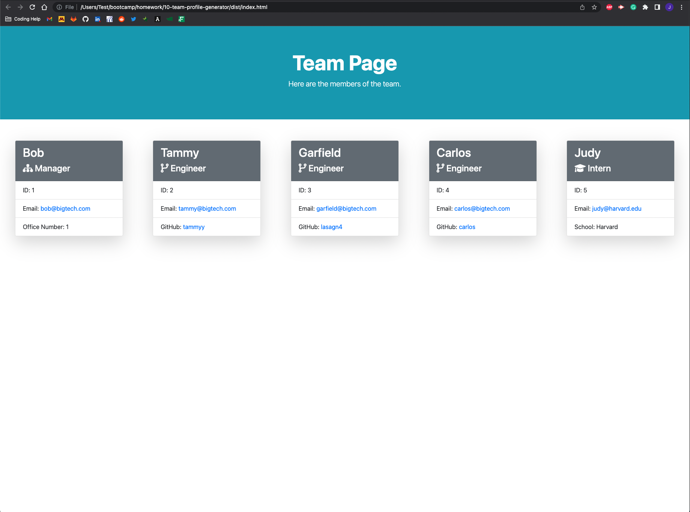

  # Team Profile Generator

  


  ## Description
  
  In this application the user creates a team profile page answering a series of prompts about the members of the team.

  When asked about the manager, the user is asked to provide their name, employee ID, email address, and office number.

  After being asked about the mananger, the user is prompted to select whether the next team member is an engineer or an intern. If the user selects engineer, they will then provide the employees name, ID, email address, and GitHub username. If the user selects intern, they will then provide the employee name, ID, email address, and school they attend.

  After creating each employee, the user is asked "Would you like to add more members to the team?" if they type Y, they will be prompted to add an engineer or intern, if they type N the team is complete.

  When the team is complete, an html file is then generated with the user provided information.

  ## Table of Contents


  -- [Installation](#Installation)

  -- [Usage](#Usage)

  -- [Test](#Test)

  -- [License](#License)


  ## Installation


  The user should clone this repository from GitHub. They should have node downloaded onto thier machine. 
  
  In order to use the application, the user must install [Inquirer](https://www.npmjs.com/package/inquirer). 
  ```sh
  npm i inquirer
  ```
  
  If the user wants to test the application they must install [Jest](https://www.npmjs.com/package/jest).
  ```sh
  npm i jest
  ```

  ## Usage

  https://user-images.githubusercontent.com/106487718/180578834-411a7146-1165-44f7-a3df-62c367483294.mp4
  
  

  ## Test

  Jest was used to run tests to make sure that all inputs were generated correctly. If the user would like to run tests with Jest installed, run the following in the terminal:
  ```sh
  npm run test
  ```
  If Jest isn't intstalled and you would like to run tests, see installation section.


  ## License


  (https://opensource.org/licenses/MIT)

  This application is licensed under The MIT License


  ## Questions


  [GitHub](https:github.com/jystyn)

  [E-Mail](mailto:justyn.helgeson@gmail.com)

